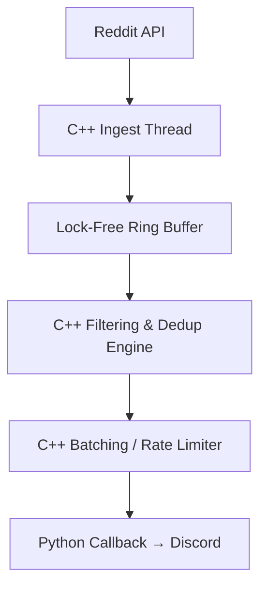

# nanoStream

**nanoStream** is an ultra‑low‑latency event pipeline for Python, powered by a C++ lock‑free engine and pybind11.  
It’s designed for real‑time bots, data ingestion systems, and HFT‑style event processing.

---

## 🚀 Features

- ⚡ Lock‑free ring buffer (SPSC or MPMC)
- 🧠 C++ filtering engine with optional SIMD acceleration
- 🕒 Microsecond‑accurate batching and pacing
- 🔁 GIL‑free ingestion and dispatch
- 🔌 Seamless Python integration via pybind11
- 🧱 Built with C++20 and CMake

---

## 📦 Installation

```bash
pip install .
```

---

## 🧪 Quick Start

```python
from nanostream import Pipeline

def on_event(event):
    print("Received:", event)

p = Pipeline(buffer_size=4096)
p.start(on_event)
```

---

## 🧱 Architecture


